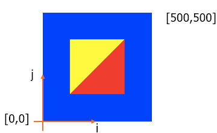

# Exercise 3: 2D Coordinate System

We are looking at the same `interaction.html` example for this exercise.

## Coordinate Space Change

The triangle is directly defined in the NDC space for the Hello World example, but you do not like this space when you are creating the objects. You find it is natural to define all axes from 0 to 100. So you make a new "mind space". The bottom-left corner of this space is [0, 0], top-right corner is [100, 100]. Can you convert the triangle (
    (0.0,  0.5), 
    (-0.5, -0.5), 
    (0.5, -0.5) ) we defined in the Hello World example to this new "mind space"? Show your steps of calculation in the submission

## Mouse Interaction

I already implemented the mouse event listener and callback function code in the example. However, the current code only prints out the mouse position in the webpage. Can you try clicking on the canvas and find out what is the coordinate system for the mouse space? You can draw a similar diagram to the one I showed in class:


The next step is to convert the position from mouse space to NDC space. Use linear mapping to derive an equation for this conversion.
Modify the example code to calculate the NDC space mouse position and show it on the canvas.

```JS
// You can modify this code to show text on the canvas. Using ${} inside a `` string in JS will directly format that variable in the string.
display.innerHTML = `Mouse: ${x}, ${y}`;
```

Finally, I want to you create a point at the location of mouse click. You can refer to previous exercises to see the code for the buffer management. 


## Submission

Submit your answer to the questions and your modified code to BlackBoard. 

>When submitting the code, you can leave out the `setupShader.js` file. I will use my copy of the file to test your code. So, do not make any change to `setupShader.js`.

