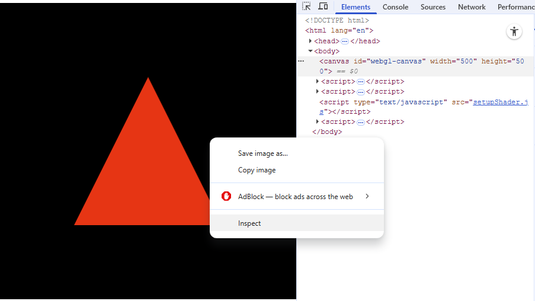
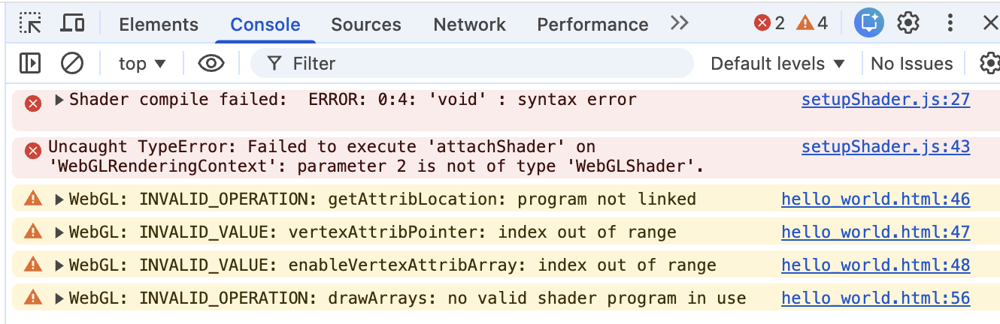

# Exercise 1: Hello world

The `hello_world.html` file is consisted of the html code and the JavaScript code. I will first go through the code and then give you this exercise instructions. I suggest avoid using AI for exercises, as you are learning fundamentals in exercises.

## HTML file

The html is the basic framework for the webpage. Since we are more focused on WebGL, the framework code will not change much from exercise to exercise.

Here is the code snippets from `hello_world.html`, we are omitting the JS part for simplicity now. In the html file, we first defines the meta-information of the webpage and create a canvas, where we are going to render the object later.
```html
<!DOCTYPE html>
<html lang="en">
<!-- head tag that contains meta information of the webpage, including the webpage title -->
<head>
    <meta charset="UTF-8">
    <meta name="viewport" content="width=device-width, initial-scale=1.0">
    <title>Hello World</title>
</head>
<!-- body tag where we create a canvas, where we render objects -->
<body>
    <!-- id is used to refer to canvas later, width and height define the size -->
    <canvas id="webgl-canvas" width="500" height="500"></canvas>

<!-- JavaScript codes -->
<script>
// Geometry stage (vertex shader) code here ...
</script>
<script>
// Rasterization stage (fragment shader) code here ...
</script>
<!-- helper code to setup the WebGL environment -->
<script type="text/javascript" src="setupShader.js"></script>
<script>
// Application Stage Code here...
</script>
<!-- JavaScript codes -->

</body>
</html>
```

> **Debug Note:** If you right click on the canvas, in most browsers, you will find a option of "inspect". Clicking that, developer tools will pop up in the side panel. You can find the html elements you created before in the developer tools.

You can also open the developer tools in Chrome by pressing F12.

## JavaScript

We have three parts of the JS codes, corresponding to application, geometry, and rasterization stage respectively. We are starting with the application stage code.

### Application Stage (Host Interface)

The following is the application stage code. As discussed in the lecture, the application stage prepares geometry and property data, then sends them to the GPU for rendering. This stage also handles the necessary setup to initialize the rendering pipeline.


There are two ways to include JS scripts in HTML: either in a separate file or directly embed them in the HTML document. For example:

```html
<script type="text/javascript" src="setupShader.js"></script>
```
We hide some of the tedious initialization work inside the `html/setupShaders.js` file. We are not discussing that in this tutorial, but you can always go to that file to see the comments that explain the code.

The above loads the script from an external file, while inline scripts are written directly between `<script>` tags. We first set up the vertices for the triangle:
```JS
// Set up triangle vertices
// const is JS constant variable
// We use Float32Array here because GPU is expecting 32-bit floating point number
const vertices = new Float32Array([
    0.0,  0.5,  // Vertex 1
    -0.5, -0.5,  // Vertex 2
    0.5, -0.5   // Vertex 3
]);
```

And then, we need to setup a buffer on GPU, so that the vertex data we prepared in the CPU can be transferred. These six lines code are for the setup. What each line does are explained in the comments:

```JS
// Create a buffer and upload the vertex data
// A buffer in WebGL is a memory object that stores vertex data, indices, or other information  on the GPU. Buffers are used to efficiently transfer large amounts of data from the CPU to the GPU for rendering. 
// This tells webGL that we are going to use an array buffer on GPU to hold data
const buffer = gl.createBuffer();
// WebGL works like a state machine, after we bind the buffer, all other functions are applied to the current bound buffer
gl.bindBuffer(gl.ARRAY_BUFFER, buffer);
// Moves the vertices we created to the GPU buffer
gl.bufferData(gl.ARRAY_BUFFER, vertices, gl.STATIC_DRAW);
// getAttribLocation finds a variable "aPosition" in the vertex shader
// We will talk about it more when moving to vertex shader
// program is an object we initialize in setupShader.js
// The program links three stages
const aPositionLocation = gl.getAttribLocation(program, 'aPosition');
// This function setup the array format for the variable aPosition, when triangle vertices are mapped to GPU vertex shader, we need to know how that array is formatted. For example, the dimensionality of the vertex is 2. They are floating point numbers. The last three arguments are: whether to normalize the data, access stride, and access offset.
gl.vertexAttribPointer(aPositionLocation, 2, gl.FLOAT, false, 0, 0);
// Finally, this line switches the aPosition from "off" to "on".
gl.enableVertexAttribArray(aPositionLocation);
```

Once the buffer are setup, we can reuse it to draw other objects by simply transfer other data using:

```JS
gl.bufferData(gl.ARRAY_BUFFER, other_vertices, gl.STATIC_DRAW);
```

Finally, we can clear the canvas and draw the triangle.

```JS
// These functions setup the size of canvas and background color, we will talk about it later
gl.viewport(0, 0, canvas.width, canvas.height);
gl.clearColor(0.0, 0.0, 0.0, 1.0);
gl.clear(gl.COLOR_BUFFER_BIT);

// Draw the triangle using the vertex array.
gl.drawArrays(gl.TRIANGLES, 0, 3);
```

### Geometry Stage (Vertex Shader)

In WebGL, vertex shader is the program to implement the geometry stage. In this step, we perform "per-vertex" calculation. Vertex shader is implemented using a language called OpenGL Shading Language (GLSL). The syntax is similar to C. 

```JavaScript
// Vertex shader source code, the source code is simply a JS string, we are using this string in setupShader.js
// Vertex and fragment shader has to be setup before setupShader.js
// In JS, you can also use `` to create a string
const vertexShaderSource = `
    ...... The actual code is moved to next code block ......
`;
```

```C
// This create a variable called "aPosition", which is the one we are referring to in the application stage code
// attribute: the keyword for a per-vertex variable, this basically create an array, the array length is the number of vertices. In this simple example, number of vertices is 3. (One triangle)
// vec2: each element of the array is a two-dimensional vector. You can think of this as a 2D array of size (num_vertices, 2)

attribute vec2 aPosition;

// main function for the vertex shader
void main() {
    // gl_Position is a built-in variable for the vertex positions. 
    // The coordinate system we are using is 4-dimensional (why? we will discuss this later)
    // vec4 simply expand the vec2 aPosition to 4-dimensional, **this happens for all vertices in aPosition**
    // Another way to think of this is adding two columns of 0 and 1.0 to the 2D array.
    // This changes the array size from (num_vertices, 2) to (num_vertices, 4)
    gl_Position = vec4(aPosition, 0, 1.0);
}
```

### Rasterization Stage (Fragment Shader)

Similar to the vertex shader, fragment shader implements the rasterization stage in WebGL. The word fragment is similar to pixel. However, it is a rasterized fragment from the object, not a pixel in the image.

Because this is a minimal example, we only assign the color of the triangle in the fragment shader.

```C
// Set the calculation precision for floating point calculation
// WebGL requires this specifically because of the mobile applications
precision mediump float;

void main() {
    // gl_FragColor is a built-in variable for the fragment colors.
    // We could set that to an array of colors so that different fragment will have different color (for shading effect)
    // Here we just set everything as an uniform red color
    // The color is in the format of RGBA (normalized in the range of 0~1)
    
    gl_FragColor = vec4(1.0, 0.0, 0.0, 1.0); // Red color
}
```

To experiment with different colors. You can use a [color picker](https://www.google.com/search?q=color+picker) to find RGB values.

> **Debug Note:** Vertex and Fragment shaders are relatively difficult to debug. If there is bug in your shader code, the error message will appear in the console tab of the web browser like this:

The error message is: `ERROR: 0:4: 'void' : syntax error`. This means the error is from the 4th line of your vertex shader at the keyword `void`. In this example, we are missing a semicolon before.

## Exercise Instruction

Understand this code and finish the following tasks:

1. Change the vertex coordinates of the triangle. See how triangle changes its shape and find out the visible drawing range of the canvas.

2. In the vertex shader, change the third and fourth dimension of the vertex coordinates to other values. In your submission, write down what is the effect of changing those values.
    ```C
    gl_Position = vec4(aPosition /*dimension 1 and 2*/, 0 /*dimension 3*/, 1.0 /*dimension 4*/);
    ```

3. In the fragment shader, change the color of the triangle to anything you like. 

Finally, screenshot the rendered triangle with new color and shape, submit that with your finding from step 1 and 2 to BlackBoard.