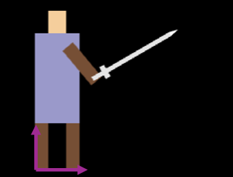

# Exercise 6: Hierarchical Transformation

This exercise will use `soldier.html` as example. I suggest avoid using AI for exercises, as you are learning fundamentals in exercises. Opening the file, you will see a soldier holding a sword.

<!-- ## Matrix Multiplication

The first task you need to finish is the function `multiplyMatrix3x3(a, b)`. You are not able to see anything before correctly complete this function. There are only two lines missing and I have the comments in the code to guide you. Remember the column-major order means the matrix is flattened to 1d in the oder: 1st-column, 2nd-column ...

After you finish the task, you should be able to see a soldier holding a sword. -->

## Understanding the Code

This example is slightly different than the examples before in the vertex shader. Following are the differences:

```C
attribute vec2 aPosition;
uniform mat3 mMatrix; // mMatrix is the composited transformation matrix
uniform mat3 pMatrix; // pMatrix (projection matrix) converts objects from world space to NDC

void main() {
    vec3 hPosition = vec3(aPosition, 1.0);
    gl_Position = vec4(pMatrix * mMatrix * hPosition, 1.0); 
    gl_PointSize = 5.0;
}
```

In the fragment shader, instead of hard-coding the color, we use a variable `uColor`. This allows us to pass an color variable from JavaScript code to fragment shader so that different objects have different colors.

I created two classes `ObjectWebGL` and `Shape` and use these two classes to create the soldier in the scene. Read and understand this code. To test your understanding, **draw the local coordinate frame for each layer of hierarchy**. The example for the first layer:



You do not need to draw the coordinates using WebGL. But you need to annotate the origin and angle for each coordinate system.

## Transformation

The soldier can not move and wave his sword yet, because the local transformation function is not implemented inside the `ObjectWebGL` class. 
```JS
local_transform(matrix){
    // TODO: implement this function
}
```
This function is called in key interaction callback functions. It should update the local transformation matrix `mMatrix` of the object. Could you implement this function?

After your implementation, the key inputs should move the soldier and wave the sword. 

## Challenge 

At this point, I want to challenge you with a final task. Now, when the soldier move backward (pressing A), he will not turn and face the new direction. Can you modify the code so that the soldier can face the direction he is moving?

> Hint: What is the geometric meaning of scaling(-1, -1)?

## Submission

Submit a report for this exercise. The report should contain:

- Your drawing of local coordinate frames for each layer
- Copy-paste the code for local_transformation in the report
- Challenge task is optional. If you finish that, copy-paste the corresponding code in your report. This task is worth **one extra credit**.

