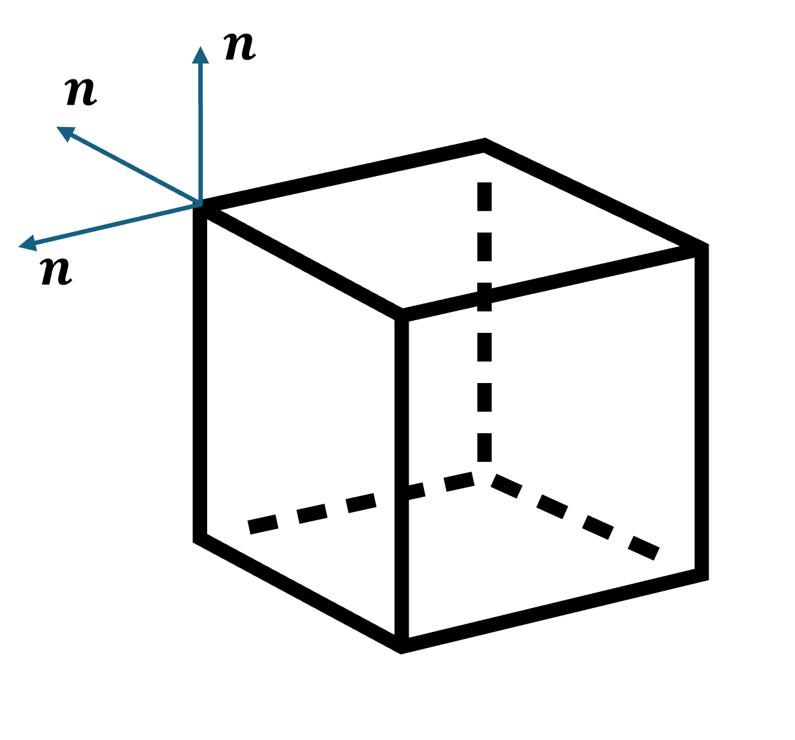

# Exercise 11: Normal Vector

This exercise focuses on 3D Viewing and Transformation. Please use the example `3d_cube.html`. Please use the exercise 10 result codes where you finished the view and projection for this exercise.

## Tasks

This exercise will get you familiar with setting up normal vectors and normal matrices. In [exercise 9](3d_transformation.md), we have implemented the rotation transformation for the 3D cube. In this exercise, we want to first set up the normal vectors for the cube and calculate normal matrix given the corresponding modeling matrix.

1. Setting up the normal vectors for 3D cube. In the original code, we represent the cube using 8 vertices. However, this is not enough if we want to accurately specify the normal vectors for 3D cube, because one vertex is shared by 3 faces and these three faces have different normal vectors. You can see this in the diagram:

    

    The solution is to duplicate the vertices for the triangles in the top, left, and back faces. This needs to be done for each vertex, so, instead of 8 vertices, we need to specify 24 vertices for the cube. After the change, you also need to update the index and color array to match the change. After the modification, the 3d cube in the canvas should still be the same.

    Then, you can add the normal vectors for each of the vertex. Currently, we do not need to use them in the shaders, so we do not need to set buffers for normal array yet.

2. The second task is to calculate the normal matrix using $N = (M^{-1})^T$. $M$ should be first converted to a 3x3 matrix before the calculation. You can find glMatrix functions to do it. And then, the new normal vector can be calculated as $\bold{n}'=N\bold{n}$. For the exercise, we will just create a dummy normal vector to test the normal matrix:
    ```JS
    let normal = vec3.fromValues(0,0,1);
    ```
    The new normal vector needs to be normalized to have unit magnitude after the applying the normal matrix.

    You can test the correctness of the normal matrix by printing out the new and old normal vector. Try applying rotation, scaling, and translation to the modeling matrix $M$. Think whether these transformations will also change the normal vector direction or not. Verify your answer by comparing the new and old normal vectors. Report your answers in your submission.


### Submission

Submit your modified code and the report to BlackBoard.
